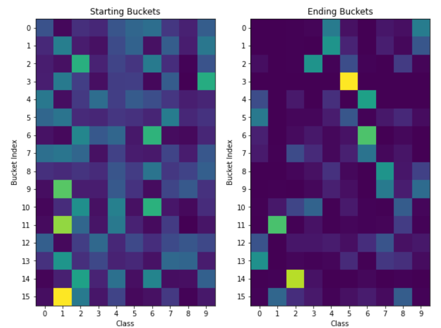
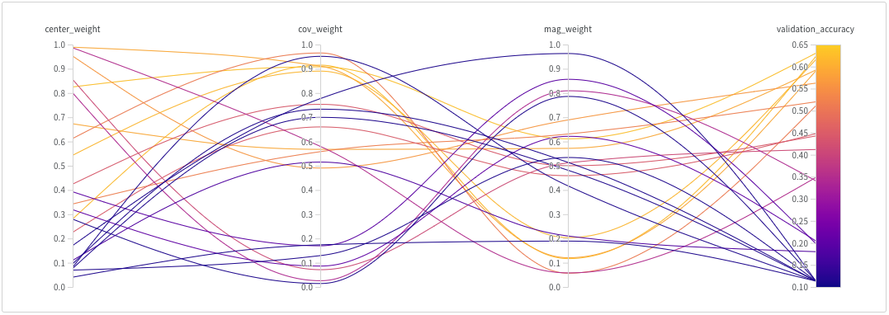

# Unsupervised learning approach to classifying MNIST

## Algorithm
This code applies a multi-layer perceptron (MLP) to the MNIST dataset. The MLP is trained without labels and without a categorical cross-entropy loss.

The output activation of the MLP is the tanh function which has a range between -1 and 1. The exact number of outputs of the model `n_out` is a hyperparameter. I experimented with between 4 and 10 outputs.

Each model output is mapped from the continuous range (-1, 1) to the discrete distribution 0 or 1. Negative values map to 0, while positive values map to 1.
The output is then interpreted as a binary number with `n_out` digits. If `n_out` were 4 there would be 16 possible outputs (0000, 0001, 0010, ... 1111)

Each unique base two number is treated as its own class or "bucket." The model maps every sample in the training data into one of the 2^`n_out` buckets.
Because each sample is labeled, a label can be placed on the bucket based on which samples get mapped to the bucket, similar to how a decision tree labels its leaf nodes.

During inference, the model maps a new sample to a bucket and classifies the sample with the label associated with the bucket.

<p align="center">
  
</p>


Figure: Buckets before and after training where `n_out = 4`. Each row is a single bucket, and each column shows the distribution of an MNIST class over the buckets. Ideally, each bucket/row would be a one-hot vector, similar to row 3. For the most part, only images portraying a hand-written 5 get mapped to row 3. If, during inference, a new sample gets mapped to row 3 the label for that sample is likely 5. 

## Inspiration
Inspired by a conversation with [Cooper](https://github.com/coopersigrist)

The inspiration behind this approach is to view each output activation (called nodes) as a binary classifier that is hopefully classifying the samples on some meaningful boolean characteristic.

For example, one node may classify samples based on if they have loops (like a 9, 8, or 0), another node may activate only if the sample has a vertical line (like a 1 or 7).

Then classes of samples can be constructed by grouping samples with shared characteristics.

Ex: Perhaps most 8's have loops but no vertical lines, so they may fall into bucket 1 0. 4's with their loop and vertical line may be assigned bucket 1 1, and 2's with neither might go to 0 0.

If these binary classes can be learned unsupervised, then it is possible to cluster samples into these binary buckets unsupervised.

## Failure Modes
I anticipated three failure modes of this model and constructed a loss function accordingly.
1. The first failure mode is when all the nodes classify on the same boolean characteristic. If all the binary classifiers are the same, no classification power is gained by combining them.
2. The second failure mode is when a node classifies every sample into the same boolean class. No classification power is gained if a node always represents a 1 or a 0 independent of the sample.
3. The third failure mode relates to how I addressed the first two, so I will discuss it later.

## Loss Function and Addressing Failure Modes
The model is trained with a custom loss function that considers three statistics over the mini-batch.
1. Covariance based loss - addresses failure mode 1
  * The covariance loss is calculated as the average magnitude of the covariance of each output activation calculated over the batch
  ```
  activation_cov = # covariance matrix of output activations calculated over the batch
  cov_loss = K.mean(K.abs(activation_cov))
  ```
  * This loss is optimal at 0 and is minimized
  * Intuitively, if the output activations are unrelated to each other more information is encoded.
2. Centering loss - addresses failure mode 2
  * The centering loss is calculated as the absolute value of the average activation
  ```
  # axis 0 is the batch dimension
  mean_activation = K.mean(activations, axis=0)
  center_loss = K.abs(mean_activation)
  ```
  * This loss is optimal at 0 and is minimized
  * When the average activation of an output node over many samples is 0, that indicates that about half the time the node is negative, and half the time the node is positive. In this context, the node is interpreted as a 0 for half the samples and a 1 for the other half.
3. Magnitude loss - introducing and addressing failure mode 3
  * The third failure mode is when the activations of the nodes are always 0
  * A constant activation of 0 would enable the covariance loss and centering loss to be 0, and therefore "optimal," but with this solution, the classifiers would have no classification power.
  * The magnitude loss is calculated as the negative average absolute value of the activations
  ```
  mag_loss = -K.mean(K.abs(activations))
  ```
  * This loss maximizes the activation of the output nodes and prohibits the model from outputting zeros to satisfy the first two losses.
  
  The total loss is computed as a weighted sum of the three losses.
  The weights applied to the different losses are important hyperparameters for this technique.

## Observations and Results
I have used [Weights and Biases](https://wandb.ai/bill-ray0259/multiclass_bin_classifier) to perform a hyperparameter search and track my experiments.

The model performs best when the magnitude loss is weighted less than the other two losses.

<p align="center">
  
</p>

[Interactive Weights and Biases figure](https://wandb.ai/bill-ray0259/multiclass_bin_classifier/reports/Shared-panel-22-02-12-12-02-67--VmlldzoxNTU0MDcy)

  
The model can classify MNIST digits significantly better than random [(maximum accuracy 63%)](https://wandb.ai/bill-ray0259/multiclass_bin_classifier/runs/a3222kcy/overview), but is still far behind the performance of even a simple linear regression model trained with the labeled samples.

Accuracy does not appear to improve much with additional training. I would be excited to hear any ideas you may have to improve what I have done here!
